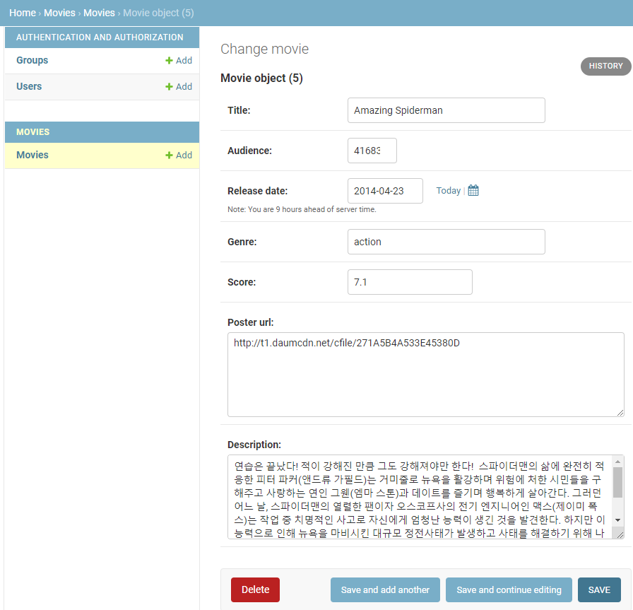
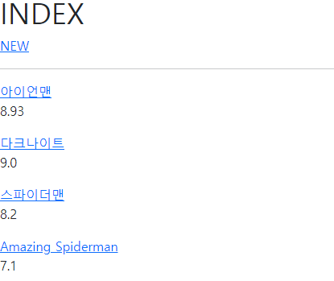
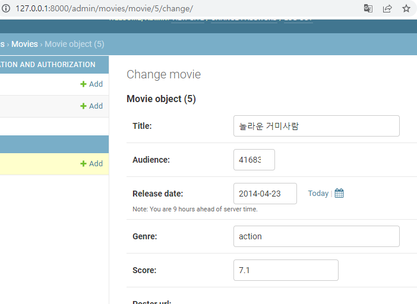
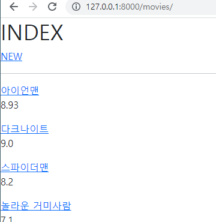

# 04 PJT

## A. base.html

```html
<!DOCTYPE html>
<html lang="en">
<head>
  <meta charset="UTF-8">
  <meta http-equiv="X-UA-Compatible" content="IE=edge">
  <meta name="viewport" content="width=device-width, initial-scale=1.0">
  <link href="https://cdn.jsdelivr.net/npm/bootstrap@5.2.0/dist/css/bootstrap.min.css" rel="stylesheet" integrity="sha384-gH2yIJqKdNHPEq0n4Mqa/HGKIhSkIHeL5AyhkYV8i59U5AR6csBvApHHNl/vI1Bx" crossorigin="anonymous">
  <title>Document</title>
</head>
<body>
  
  

  <script src="https://cdn.jsdelivr.net/npm/bootstrap@5.2.0/dist/js/bootstrap.bundle.min.js" integrity="sha384-A3rJD856KowSb7dwlZdYEkO39Gagi7vIsF0jrRAoQmDKKtQBHUuLZ9AsSv4jD4Xa" crossorigin="anonymous"></script>
</body>
</html>
```

호기롭게 bootstrap cdn을 추가하면서 시작했지만 결국 쓰지 못하고 기본 기능만 만들었습니다. 

## B. index.html

```html



  <h1>INDEX</h1>
  <a href="">NEW</a>
  <hr>
  
    <a href="">{{ movie.title }}</a>
    <p>{{ movie.score }}</p>
  
k content %}

```

index.html 까지는 문제 없이 작성할 수 있었습니다.

## C. detail.html

```html



  <h1>DETAIL</h1>
  
  <h4>{{ movie.title }}</h4>
  <p>Audience : {{ movie.audience }}</p>
  <p>Release Dates : {{ movie.release_date }}</p>
  <p>Genre : {{ movie.genre }}</p>
  <p>Score : {{ movie.score }}</p>
  <p>{{ movie.description }}</p>
  <a href="">EDIT</a>
  <form action="" method="POST">
    
    <input type="submit" value="DELETE">
  </form>
  <a href="">BACK</a>



```

detail.html 을 작성하면서 조금씩 헷갈리기 시작했습니다. detail부터 기본키를 넘겨받기 시작하는데 urls.py에서 path 작성할때 \<int:pk\>/ 를 안적기도 했습니다. 다행히 이렇게 막힐 때마다 어제 실습했던 자료를 보면서 고쳐갔습니다.

delete 버튼의 경우 input으로 해야하는지 button으로 해야하는지 고민했는데 알고보니 얘초에 form 태그안에 넣어야하는데 form태그를 넣어야한다고 생각을 못했던게 문제였습니다. 

## D. new.html

```html
 


  <h1>NEW</h1>
  <hr>
  <form action="" method="POST">
    
    <label for="title">TITLE </label>
    <input type="text" id="title" name="title">
    <br>
    <label for="audience ">AUDIENCE </label>
    <input type="text" id="audience" name="audience">
    <br>
    <label for="release_date">RELEASE_DATE </label>
    <input type="date" id="release_date" name="release_date">
    <br>
    <label for="genre">GENRE </label>
    <select name="genre" id="genre">
      <option value="option">옵션</option>
      <option value="action">액션</option>
      <option value="comedy">코미디</option>
      <option value="sf">SF</option>
    </select>
    <br>
    <label for="score">SCORE </label>
    <input type="text" id="score" name="score">
    <br>
    <label for="poster_url">POSTER_URL </label>
    <input type="text" id="poster_url" name="poster_url">
    <br>
    <label for="description">DESCRIPTION </label>
    <input type="text" id="description" name="description">
    <br>
    <input type="submit" value="Submit">
  </form>
  <hr>
  <a href="">BACK</a>
  

```

new.html은 기본키를 넘겨주지 않아서 html 파일과 urls의 path를 작성할 땐 바로 했습니다.

하지만 views 작성할 때 따로 create 함수를 만들어줘야한다는 걸 알았고 다시 urls에 path 추가하고 views create 함수를 작성했습니다. POST로 전송받은 데이터를 받는 코드가 기억이 안나는거 보고 '아 난 이거 따라가기만 했구나'라는 생각이 들었습니다. 그래서 이해할 정도로 공부하고 다시 코드를 작성했습니다.

request.POST.get([변수이름]) -> POST형식으로 전송된 request의 [변수이름] 반환

## E. edit.html

```html



  <h1>EDIT</h1>
  <hr>
  <form action="" method="POST">
    
    <label for="title">TITLE </label>
    <input type="text" id="title" name="title" value="{{ movie.title }}">
    <br>
    <label for="audience ">AUDIENCE </label>
    <input type="text" id="audience" name="audience" value="{{ movie.audience }}">
    <br>
    <label for="release_date">RELEASE_DATE </label>
    <input type="date" id="release_date" name="release_date" value="{{ movie.release_date | date:'Y-m-d' }}">
    <br>
    <label for="genre">GENRE </label>
    <select name="genre" id="genre">
      <option value="option">{{ movie.genre }}</option>
      <option value="action">액션</option>
      <option value="comedy">코미디</option>
      <option value="sf">SF</option>
    </select>
    <br>
    <label for="score">SCORE </label>
    <input type="text" id="score" name="score" value="{{ movie.score }}">
    <br>
    <label for="poster_url">POSTER_URL </label>
    <input type="text" id="poster_url" name="poster_url" value="{{ movie.poster_url }}">
    <br>
    <label for="description">DESCRIPTION </label>
    <input type="text" id="description" name="description" value="{{ movie.description }}">
    <br>
    <button>
      <a href="">Reset</a>
    </button>
    <input type="submit" value="Submit">
  </form>
  

```

초기화는 원래 저장된 상태로 돌아가면 되므로 원래 저장된 정보를 그대로 불어오도록 만들었습니다. release_date의 경우 정확한 형태가 아니면 date 타입 input 태그에 원래 정보가 적용되지 않아서 변수 필터를 사용했습니다(희제님이 알려주셨습니다). 


## admin 으로 CRUD 해보기






## 후기

장르선택하는 select 태그를 작성할때 옵션을 반복을 제회하고 넣을 순 없는지 궁금했습니다. 보고서 작성하고 찾아볼려고 합니다. 그리고 확실히 어제 다 배웠다고 생각했는데 아무것도 적혀있지 않는 상태에서 혼자 path 설정하고 base작성하고 프로젝트의 setting에서 BASIC_DIC으로 templates 설정하는 등 많이 놓치는 부분이 많았다는 것을 알았습니다. path작성하는 법, views에 함수 작성하는 법, DTL 사용법은 이제 잘쓸 수 있을것 같습니다 ㅎㅎ
