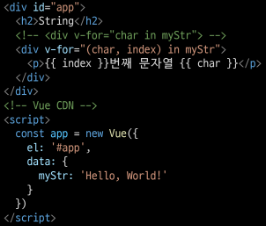
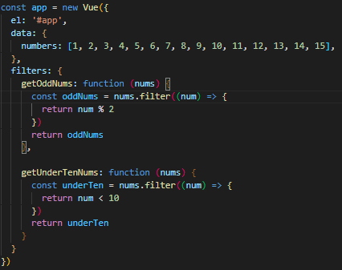

# Vue

## INDEX

- Vue intro

- Why Vue

- Vue instance

- Basic of syntax

- Vue advanced

## Vue intro

#### 사전 준비

- VSCode Vetur extension
  
  -> 문법 하이라이티, 자동완성 디버깅 기능 제공

- Chrome Vue devtools extension 설치 및 설정
  
  -> 크롬 브라우저 개발자 도구에 vue디버깅 기능 제공

#### 개요

- Front-end 개발이란?

- Front-end framework란 무엇인가

- Vue를 배우는 이유

- Vue 기초 문법

### Front-end Development

#### 개요

- 우리가 앞으로 할 일은 JavaScript를 활용한 Front-end 개발

- Back-end 개발을 Django로 진행

#### Front-end Framework

- **Front-end(FE)** 개발이란?
  
  - 사용자에게 보여주는 화면 만들기

- **Web App(SPA)** 을 만들 때 사용하는 도구
  
  - SPA = Single Page Application

#### Web App이란?

- 웹 브라우저에서 실행되는 어플리케이션 소프트웨어

- 개발자 도구 > 디바이스 모드

- 웹 페이지가 그대로 보이는 것이 아닌 디바이스에 설치된 App처럼 보이는 것

#### SPA (Single Page Application)

- Web App과 함께 자주 등장할 용어 SPA

- 서버에서 최초 1장의 HTML만 전달받아 모든 요청에 대응하는 방식을 의미
  
  - CSR(Client Side Renderint) 방식으로 요청을 처리

#### [참고] SSR(Server Side Rendering)

- 기존의 요청 방식은 SSR

- 전달 받은 새 문서를 보여주기 위해 브라우저는 새로고침을 진행

#### CSR (Client Side Rendering) 이란?

- 최초 한 장의 HTML을 받아오는 것은 동일 
  
  - 단, server로부터 최초로 받아오는 문서는 빈 html 문서

- 각 요청에 대한 대응을 JavaScript를 사용하여 필요한 부분만 다시 렌더링
1) 새로운 페이지를 서버에 AJAX로 요청

2) 서버는 화면을 그리기 위해 필요한 데이터를 JSON방식으로 전달

3) JSON 데이터를 JavaScript로 처리, DOM 트리에 반영(렌더링)

#### 왜  CSR 방식을 사용하는 걸까?

1) 모든 HTML 페이지를 서버로부터 받아서 표시하지 않아도 됨
   
   - 클라이언트 - 서버간 통신 즉, 트래픽이 감소
   
   - 트래픽이 감소한다 = 응답 속도가 빨라진다.

2) 매번 새 문서를 받아 새로고침하는 것이 아니라 필요한 부분만 고쳐 나가므로 각 요청이 끊김없이 진행
   
   - SNS에서 추천을 누를 때 마다 첫 페이지로 돌아간다 = 끔찍한 App!
   
   - 요청이 자연스럽게 진행이 된다 = UX 향상

3) BE와 FE의 작업 영역을 명확히 분리 할 수 있음
   
   - 각자 맡은 역할을 명확히 분리한다. = 협업이 용이해짐

#### CSR은 만능일까?

- 첫 구정 시 필요한 데이터가 많으면 많을수록 최초 작동 시작까지 오랜 시간이 소요

- Naver, Netfile 등 모바일에 설치된 Web-App을 실행 하게 되면 잠깐의 로딩 시간이 필요

- **검색 엔진 최적화(SEO, Search Engine Optimization)** 가 어려움
  
  - 서버가 제공하는 것은 텅 빈 HTML
  
  - 내용을 채우는 것은 AJAX 요청으로 얻은 JSON 데이터로 클라이넌트(브라우저)가 진행

- 대체적으로 HTML에 작성된 내용을 기반으로 하는 검색 엔진에 빈 HTML을 공유하는 SPA 서비스가 노출되기는 어려움

#### SEO(Search Engine Optimization)

- google과 같은 검색 엔진 등에 내 서비스나 제품 등이 효율적으로 검색 엔진에 노출되도록 개선하는 과정을 일컫는 작업

- 검색 = 각 사이트가 운용하는 검색 엔진에 의해 이루어지는 작업

- 검색 엔진 = 웹 상에 존재하는 가능한 모든 정보들을 긁어 모으는 방식으로 동작
  
  - 정보의 대상은 주로 HTML에 작성된 내용
  
  - JavaScript가 실행된 이후의 결과를 확인하는 과정이 없음

#### CSR vs SSR

- CSR과 SSR은 흑과 백이 아님
  
  - 내 서비스에 적합한 렌더링 방식을 적절하게 활용할 수 있어야 함

- SPA 서비스에서도 SSR을 지원하는 Framework도 발전하고 있음
  
  - Vue : Nuxt.js
  
  - React : Next.js
  
  - Angular Universal 등

## Why Vue

#### 왜 우리는 vue를 배울까?

- 쉽다

- 입문자가 시작하기에 좋은 Framework

- Vue를 발표한 개발자 Evan You

- 구글의 Angular개발자 출신

- Angular보다 가볍고, 간편하게 사용할 수 있는 Framework를 만들기 위해 퇴사

- 2014년 발표

#### Vue는 정말 쉬울까?

- Vue 구조는 매우 직관적임

- FE Framework 를 빠르고 쉽게 학습하고 활용 가능

#### Vue CDN

- Vue로 작업을 시작하기 위해여 CDN을 가져와야 함

- Bootstrap에서 사용하였던 CDN방식 제공

- npm 활용을 추후에 진행 예정

- Vue CDN을 위하여 Vue2 공식 문서 접속
1) Getting Started

2) Installation

3) Development version CDN 복사

#### Vue로 코드 작성하기

1) Vue CDN 가져오기
   
   

2) Vue instance 생성 

3) new 연산자를 사용한 생성자 함수 호출 (**const vm = new Vue()**)

4) **el, data** 설정
   
   - data에 관리할 속성 정의

5) 선언적 렌더링 {{ }}
   
   - Vue data를 화면에 렌더링

#### [참고] Dev Tools 확인

#### Vue로 코드 작성하기

- input tag에 v-model  작성
  
  - input에 값 입력 -> Vue data 반영
  
  - Vue data -> Dom 반영

### Vue 2 vs Vue 3

#### Vue 3

- 2022sus 02월 부터 vue 프레임워크의 기본 버전이 3버전으로 전환

- 대체적인 설정들이 Vue 3을 기본으로 적용되어 있음
  
  -> ex) 공식 문서, CDN, npm 등

#### Vue 2

- 여전히 vue2가 많이 사용됨 (legacy code)

- 사용된 기간이 긴 만큼 상대적응로 많은 문서의 양, 참고자료, 질문/답변

## Vue instance

#### MVVM Patter

- 소프트웨어 아키텍처 패턴의 일종

- 마크업 언어로 구현하는 그래픽 사용자 인터페이스(view)의 개발을 Back-end(model)로부터 분리시켜 view가 어느 특정한 모델 플랫폼에 종속되지 않도록 함

- View - 우리 눈에 보이는 부분 = DOM

- Model - 실제 데이터 = JSON

- View Model (Vue)
  
  - View를 위한 Model
  
  - View와 연결(binding)되어 Action을 주고 받음
  
  - Model이 변경되면 View Model도 변경되고 바인딩된 View도 변경됨

- View 와 Model은 서로 독립적, 적은 의존성

- DOM과 DATA도 독립적

#### [생성자 함수]

- 동일한 구조의 객체를 여러 개 만들고 싶다면?

- 생성자 함수는 특별한 함수를 의미하는 것이 아님

- new 연산자로 사용하는 함수
  
  

#### el (element)

- Vue instance와 DOM을 mount(연결)하는 옵션
  
  - View와 Model을 연결하는 역할
  
  - HTML id 혹은 class 와 마운트 가은

- Vue instace와 연결되지 않은 DOM 외부는 Vue의 영향을 받지 않음
  
  - Vue 속성 및 메서드 사용 불가

- 생성자 함수 첫번째 인자로 Object 작성

- el 옵션에 #app 작성 = DOM 연결

#### data

- Vue instance의 데이터 객체 혹은 인스턴스 속성

- 데이터 객체는 반드시 기본 객체 {} (Object) 여야 함

- 객체 내부의 아이템들은 value로 모든 타입의 객체를 가질 수 있음

- 정의된 속성은 interpolation {{}}을 통해 view에 렌더링 가능함

- Vue instance에 data 객체 추가

- 추가된 객체의 각 값들은 this.message 형태로 접근 가능

#### methods

- Vue instance의 method들을 정의하는 곳

- methods 객체 정의
  
  - 객체 내 print method 정의
  
  - print method 실행 시 
  
  - Vue instance의 data내 message 출력
  
  

- this는 Vue를 가리킴

- 콘솔창에서 **app.print()** 실행

- method를 호출하여 data 변경 가능
  
  - 객체 내 bye method 정의
  
  - print method 실행 시 Vue instance 의 data 내 message 변경

- 콘솔창에서 app.bye() 실행

#### [주의] methods with Arrow Function

- 메서드를 정의 할 때, Arrow Function을 사용하면 안됨

- Arrow Function 의 this는 함수가 선언될 때 상위 스코프를 가리킴

- 즉, this가 상위 객체 window를 가리킴

- 호출은 문제 없이 가능하나 this로 Vue의 data를변경하지 못함

## Basic of Syntax

#### Template Syntax

- Vue2 guide > template syntax 참고

- 렌더링 된 DOM을 기본 Vue instance의 data에 선언적으로 바인딩 할 수 있는 HTML 기반 template syntax를 사용
  
  - 렌더링 된 DOM - 브라우저에 의해 보기 좋게 그려질 HTML 코드
  
  - HTML 기반 template syntax - HTML 코드에 직접 작성할 수 있는 문법 제공

#### Template

- 가장 기본적인 바인딩(연결) 방법

- 중괄호 2개로 표기

- DTL과 동일한 형태로 작성

- Template interpolation 방법은 HTML을 일반 텍스트로 표현

#### RAW HTML

- v-html directive을 사용하여 data와 바인딩

#### [참고] JS 표현식

- 표현식 형태로 작성 가능

## Directives

#### Directives 기본 구성

- v-접두사가 있는 특수 속성에는 값을 할당 할 수 있음
  
  - 값에는 JS표현식을 작성 할 수 있음

- directive의 역할은 표현식의 값이 변경될 때 반응적으로 DOM에 적용하는 것

- ': '을 통해 전달인자를 받을 수 있음

- '.' 으로 표시되는 특수 접미사 - directive를 특별한 방법으로 바인딩해야 함

#### v-text

- Template Interpolation과 함께 가장 기본적인 바인딩 방법

- {{}}와 동일한 역할 ( 정확히 동일한 역할인 것은 아님 )

#### v-html

- RAW HTML을 표현할 수 있는 방법

- 단, 사용자가 입력하거나 제공하는 컨텐츠에는 **절대 사용 금지**
  
  - XSS 공격 참고

#### v-show

- 표현식에 작성된 값에 따라 element를 보여 줄 것인지 결정
  
  - boolean 값이 변경 될 때마다 반응

- 대상 element의 display 속성을 기본 속성과 none으로 toggle

- 요소 자체는 보이지 않아도 DOM에 렌더링 됨

- vue dev tools에서 isActive의 true false 입력 가능

#### v-if

- v-show와 사용 방법을 동일

- isActive의 값이 변경 될 때 반응

- 단, 값이 false인 경우 DOM에서 사람지

- v-if, v-else-if, v-else 형태로 사용

#### v-show VS v-if

- v-show (Expensive initial load, cheap toggle)
  
  - 표현식 결과와 관계 없이 렌더링 되므로 초기 렌더링에 필요한 비용은 v-if 보다 높을 수 있음

- v-if (Cheap initial load, expensive toggle)
  
  - 표현식 결과가 false인 경우 렌더링조차 되지 않으므로 초기 렌더링 비용은 v-show보다 낮을 수 있음

#### v-for

- for .. in .. 형식으로 작성

- 반복한 데이터 타입에 모두 사용 가능

- index를 함께 출력하고자 한다면 (char, index) 형태로 사용 가능

- 배열 역시 문자열과 동일하게 사용 가능

- 각 요소가 객체라면 dot notation으로 접근 할 수 있음

#### [참고] 특수 속성 key

- "v-for 사용시 **반드시** key 속성을 각 요소에 작성"

- 주로 v-for directive 작성 시 사용

- vue 화면 구성 시 이전과 달라진 점을 확인하는 용도로 활용
  
  - 따라서 key가 **중복되어서는 안됨**

- 각 요소가 고유한 겂을 가지고 있지 않다면 생략할 수 있음

#### v-on

- method에 인자를 넘기는 방법은 일반 함수를 호출할 때와 동일한 방식

- ':' 을 통해 전달된 인자에 따라 특별한 modifiers 가 있을 수 있음
  
  - ex) v-on : keyup.enter 등
  
  - vue2 가이드 > api > v-on 파트 참고

- '@' shorcut 제공
  
  - ex) @keyup.click

#### v-bind

- HTML 기본 속성에 Vue data를 연결

- class의 경우 다양한 형태로 연결 가능

- HTML 기본 속성에 Vue  data를 연결

- Class의 경우 다양한 형태로 연결 가능
  
  - 조건부 바인딩
    
    - { 'class Name' : '조건 표현식' }
    
    - 삼항 연산자도 가능
  
  - 다중 바인딩
    
    - ['JS표현식', 'JS표현식', ...]

- ':' shortcut 제공
  
  - ex) :class 등

#### v-model

- Vue instance와 DOM의 양방향 바인딩

- Vue data 변경 시 v-model로 연결된 사용자 입력 element에도 적용

- 실시간 바인딩은 어려움

## Vue advanced

#### computed

- Vue instance가 가진 options 중 하나

- computed 개체와 정의한 함수를 페이지가 최초로 렌더링 될 때 호출하여 계산
  
  - 계산 결과가 변하기 전까지 재호출하는 것이 아닌 계산되 값을 반환

#### method VS computed

- method
  
  - 호출 될 때마다 함수를 실행
  
  - 같은 결과여도 매번 새롭게 계산

- computed
  
  - 함수의 종속 대상의 변화에 따라 계산 여부가 결정됨
  
  - 종속 대상이 변하기 않으면 항상 저장(캐싱)된 값을 반환

#### watch

- 특정 데이터의 변화를 감지하는 기능
  
  1) watch 객체를 정의
  
  2) 감시할 대상 data를 지정
  
  3) data가 변할 시 실행 할 함수를 정의

- 감시 대상 data의 이름으로 객체 생성

- Array, Object의 내부 요소 변경을 감지를 위해서는 deep 속성 추가 필요

#### filters

- 텍스트 형식화를 적용할 수 있는 필터

- interpolation 혹은 v-bind를 이용할 때 사용 가능

- 필터는 자바스크립트 표현식 마지막에 '|'(파이프)와 함께 추가되어야 함

- 이어서 사용 가능(chaining) 가능

