# Vue.js : Vue CLI

## INDEX

- Vue CLI

- SFC

- Pass Props & Emit Events

## Vue CLI

### Node.js

- 자바스크립트는 브라우저를 조작하는 유일한 언어
  
  - 하지만 브라우저 밖에서는 구동할 수 없었음

- 자바스크립트를 구동하기 위한 런타임 환경임 Node.js 로 인해 브라우저가 아닌 환경에서도 구동할 수 있게 됨
  
  - Chrome V8 엔진을 제공하여 여러 OS 환경에서 실행할 수 있는 환경을 제공
  
  - Server-Side-Programming 이 가능해짐

#### NPM(Node Package Manage)

- 자바스크립트 패키지 관리자
  
  - pip와 마찬가지로 다양한 의존성 패키지를 관리

#### Vue CLI

- Vue 개발을 위한 표준 도구

- 프로젝트의 구성을 도와주는 역할

- 확장 플러그인, GUI, Babel등 다양한 tool 제공

#### Vue CLI Quick Srart

- 설치 (global에서 설치 <-> django와 차이점)
  
  

- 프로젝트 생성
  
  - vscode terminal에서 진행
  
  

- Vue 버전 선택(Vue 2)
  
  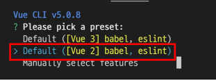

- 프로젝트 생성 성공 (프로젝트 바로 실행 불가능 -> 출력된 명령어 따라가기)
  
  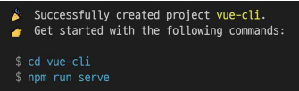

- 출력된 명령어 실행
  
  - 프로젝트 디렉토리로 이동
  
  
  
  - 프로젝트 실행
  
  
  
  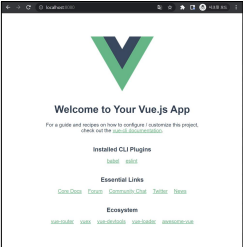

#### Vue CLI 프로젝트 구조

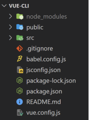

- git init이 되어 있는 상태임
  
  -> git 안에 git 폴더가 있는 상태라 .git을 지워줘야함

#### node_modules

- node.js 환경의 여러 의존성 모듈

- python의 venv와 비슷한 역할을 함
  
  - 따라서 .gitignore에 넣어주어야 하며, Vue 프로젝트 생성시 자동으로 추가됨

- 무려 133MB -> venv와 차원이 다름

#### node_modules - Babel

- "JavaScript compiler" 

- 자바스크립트의 ES6+ 코드를 **구버전으로 번역/변환** 해주는 도구

- 자바스크립트의 파펴놔, 표준화의 영향으로 작성된 코드의 스펙트럼이 매우 다양
  
  - 최신 문법을 사용해도 브라우저의 버전 별로 동작하지 않는 상황이 발생
  
  - 버전에 따른 같은 의미의 다른 코드를 작성하는 등의 대응이 필요해졌고, 이러한 문제를 해결하기 위한 도구
  
  - 원시 코드(최신 버전)를 목적 코드(구 버전)으로 옮기는 번역기가 등장하면서 더 이상 **코드가 특정 브라우저에서 동작하지 않는 상황에 대해 크게 고민하지 않을 수 있음**

#### Babel 동작 예시

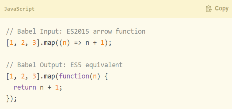

#### node_modules - Webpack

- "static module bundler"

- 모듈 간의 의존성 문제를 해결하기 위한 도구

- 프로젝트에 필요한 모든 모듈을 매핑하고 내부적으로 종속성 그래프를 빌드함

#### Module

- 개발하는 애플리케이션의 크기가 커지고 복잡해지면 파일 하나에 모든 기능을 담기 어려워짐

- 따라서 자연스럽게 파일을 여러 개로 분리하여 관리를 하게 되었고, 이때 분리된 파일 각각이 모듈(module) 즉, js 파일 하나가 하나의 모듈

- 모듈을 대개 **기능 단위로 분리**하며, 클래스 하나 혹은 특정한 목적을 가진 복수의 함수로 구성된 라이브러리 하나로 구성됨

- 여러 모듈 시스템
  
  -  ESM(ECMA Script Module), AMD, CommonJS, UMD

#### Module 의존성 문제

- 모듈의 수가 많아지고 라이브러리 혹은 모듈 간의 의존성(연결성)이 깊어지면서 특정한 곳에서 발생한 문제가 어떤 모듈 간의 문제인지 파악하기 어려움
  
  - Webpack은 이 모듈 간의 의존성 문제를 해결하기 위해 등장

#### Bundler

- 모듈 의존성 문제를 해결해주는 작업이 Bundling

- Bundling된 결과물은 개별 모듈의 실행 순서에 영향을 받지 않고 동작하게 됨

- Vue CLI는 이러한 Babel, Webpack에 대한 초기 설정이 자동으로 되어 있음

#### node_modules의 의존성 깊이 밈

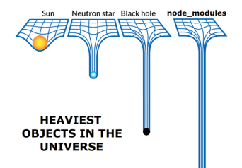

- 블랙홀보다 깊음 ㄷㄷ

- 여러 사건들
  
  - 16년도 kik 사건

#### Webpack - static module bundler

- 의존성을 Webpakc이 담당해 주므로 개발자는 npm install을 사용해 다양한 모듈을 한 번에 설치하고 각 모듈을 사용해 개발에 집중할 수 있음

#### package.json

- 프로젝트의 종속성 목록과 지원되는 브라우저에 대한 구성 옵션을 포함

#### package-lock.json

- node_modules에 설치되는 모듈과 관련된 모든 의존성을 설정 및 관리

- 협업 및 배포 환경에서 정확히 동일한 종속성을 설치하도록 보장하는 표현

- 사용 할 패키지의 버전을 고정

- 개발 과정 간의 의존성 패키지 충돌 방지

- python 의 requirements.txt 역할 

- 자동으로 추가 갱신됨 -> **직접 수정하지 말기!!!**

#### public/favicon.ico

- 서버 실행 시 탭에 나오는 작은 아이콘

#### public/index.html

- Vue 앱의 뼈대가 되는 html 파일

- Vue 앱과 연결될 요소가 있음
  
  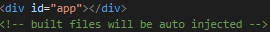

#### src/

- src/assets
  
  - 정적 파일을 저장하는 디렉토리

- src/compents
  
  - 하위 컨포넌트들이 위이

- **src/App.vue**
  
  - 최상위 컨포넌트
  
  - **public/index.html과 연결됨**

- src/main.js
  
  - webpack이 빌드를 시작할 때 가장 먼저 불러오는 entry point
  
  - public/index.html 고 src/App.vue를 연결시키는 작업이 이루어지는 곳
  
  - Vue 전역에서 활용 할 모듈을 등록할 수 있는 파일

## SFC

#### component

- UI를 독립적이고 재사용 가능한 조각들로 나눈 것
  
  - 즉, 기능별로 분화한 코드 조각

- CS에서는 다시 사용할 수 있는 범용성을 위해 개발된 소프트웨어 구성 요소를 의미

- 하나의 app을 구성할 때 중첩된 컴포넌트들의 tree로 구성하는 것이 보편적임
  
  - web시간에 배운 HTML 요소들의 중첩을 떠올려 보자!
    
    - Body tag 을 root node로 하는 tree의 구조이다
    
    - 마찬가지로, Vue에서는 **src/App.vue를 root node로 하는 tree의 구조**를 가짐

- 컴포넌트는 **유지보수를 쉽게 만들어 줄** 뿐만 아니라 재사용성의 측면에서도 매우 강력한  기능을 제공

#### Django에서의 예시

- 우리는 base.html과 index.html을 분리하여 작성하였지만, 하나의 화면으로 볼 수 있다.
  
  - 즉, 한 화면은 여러 개의 컴포넌트로 이루어질 수 있음

- base.html을 변경하면 이를 extents하는 모든 화면에 영향을 미침
  
  - 유지 보수를 쉽게 해줌

- index.html에서 for문을 통해 여러 게시글들을 하나의 형식에 맞추어서 출력해줌
  
  - 형식을 재사용하고 있었음

#### Component based architecture 특징

- 관리가 용이
  
  - 유지/보수 비용 감소

- 재사용성

- 확장 가능

- 캡슐화

- 독립적

## SFC

#### component in Vue

- 그렇다면 Vue에서 말하는 component란 무엇일까?
  
  - 이름이 있는 재사용 가능한Vue instance

- 그렇다면 Vue instance란?
  
  - 앞서 수업에서 사용한 new Vue()로 만든 인스턴스

#### SFC (Single File Component)

- 하나의 .vue 파일이 하나의 Vue instance이고, 하나의 컴포넌트이다.

- Vue instance에서는 HTML, CSS, JavaScript 코드를 한번에 관리
  
  - 이 Vue instance를 기능 단위로 작성하는 것이 핵심!!

#### 정리

- HTML, CSS, 그리고 Javascript를 .vue라는 확장자를 가진 파일 안에서 관리하여 개발

- 이 파일을 Vue instance, 또는 Vue component라고 하며, **기능 단위**로 작성

- Vue CLI 가 Vue 를 Component based하게 사용하도록 도와줌

## Vue component

#### Vue component 구조

- 템플릿(HTML)
  
  - HTML의 body 부분
  
  - 눈으로 보여지는 요소 작성
  
  - 다른 컴포넌트를 HTML 요소처럼 추가 기능

- 스크립트(JavaScript)
  
  - JavaScript 코드가 작성되는 곳
  
  - 컴포넌트 정보, 데이터, 메서드 등 vue 인스턴스를 구성하는 대부분이 작성 됨

- 스타일(CSS)
  
  - CSS가 작성되며 컴포넌트의 스타일을 담당

#### Vue component 구조 정리

- 컴포넌트들이 tree 구조를 이루어 하나의 페이지를 만듦

- root에 해당하는 최상단의 component가 App.vue

- 이 App.vue를 index.html과 연결

- 결국 index.html 파일 하나만을 rendering
  
  - 이게 바로 SPA

## Vue component 실습

#### 현재 구조

- Vue CLI를 실행하면 이미 HelloWorld.vue라는 컴포넌트가 생성되어 있고 App.vue에 등록되어 사용되고 있음
  
  - npm run serve 명령어를 진행 했을 때 나온 화면이 대부분이 HelloWorld.vue

#### Mycomponent.vue

1) **src/components/ 안에 생성**

2) **script에 이름 등록**

3) **template에 요소 추가**

**주의)** template 안에는 반드시 하나의 요소만 추가 가능

- 비어 있어도 안됨

- 해당 요소 안에 추가 요소를 작성해야함 

#### component 등록 3단계

1. 불러오기

2. 등록하기

3. 보여주기

#### component 등록 - 불러오기

- import {instance name} from {위치}

- instance name은 instance 생성 시 작성한 name
  
  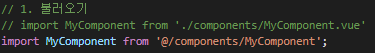

- @는 src의 shortcut

- .vue 생략 가능

#### component 등록 - 등록하기

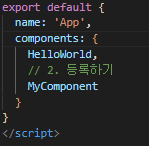

#### component 등록 - 보여주기

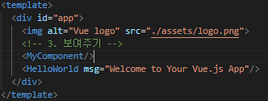

#### 자식 컴포넌트 작성

- 이제 MyComponent의 자식 컴포넌트를 만들어보자

- 자식 관계를 표현하기 위해 기존 MyComponent에 간단한 border를 추가

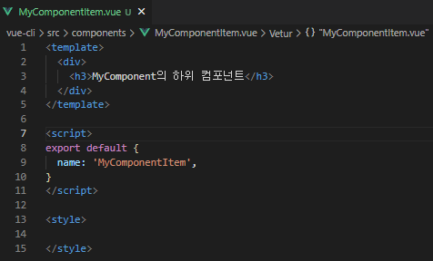

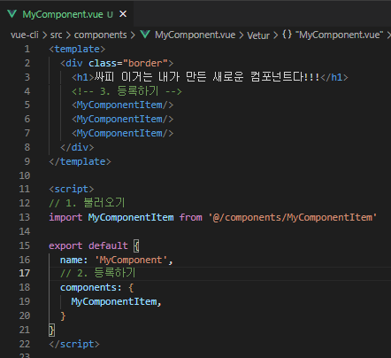

#### 컴포넌트 이름에 대한 스타일 가이드가 존재

- [Style Guide — Vue.js](https://vue2.hphk.io/v2/style-guide/#%EC%8B%B1%EA%B8%80-%ED%8C%8C%EC%9D%BC-%EC%BB%B4%ED%8F%AC%EB%84%8C%ED%8A%B8-%EC%9D%B4%EB%A6%84-%EA%B7%9C%EC%B9%99-%EC%A7%80%EC%A0%95-casing-%EB%A7%A4%EC%9A%B0-%EC%B6%94%EC%B2%9C%ED%95%A8)

- 
