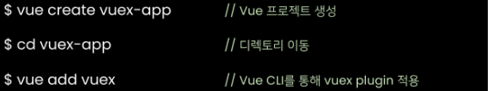
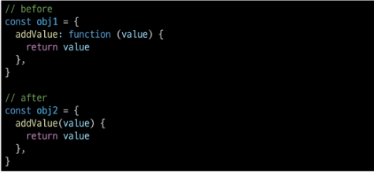
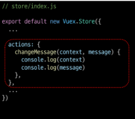
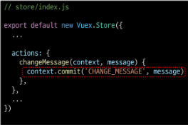
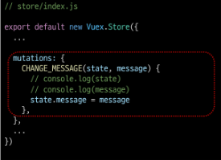
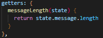
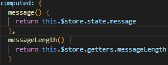
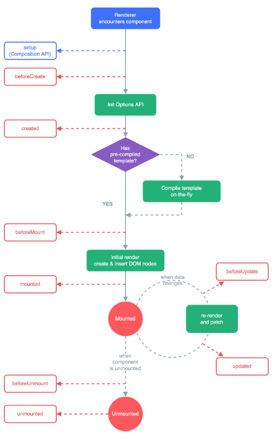
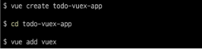

# Vuex

## INDEX

- Vuex

- lifecycle Hooks

- Todo with Vuex

## Vuex

#### 개요

- 상태 관리가 무엇언지 이해하기

- Vuex가 무엇인지, 왜 필요한지 이해하기

- Vuex 기본 문법 알아보기

### State Management

#### 상태 관리

- 상태란? 
  
  - 현재에 대한 정보(data)

- Web Application에서의 상태는 **<mark>현재 App이 가지고 있는 Data로 표현**</mark>할 수 있음

- 각 component는 독립적이기 대문에 각각의 상태(data)를 가짐
  
  - 여러 개의 component가 같은 상태(data)르 유지할 필요가 있음
    
    -> <mark>상태 관리(State Management) 필요!!</mark>

#### Pass Props & Emit Event

- 지금까진 props 와 event 를 이용해서 상태 관리를 하고 있음

- 같은 데이터를 공유하고 있으므로, 각 컴포넌트가 동일한 상태를 유지하고 있음

- **하지만** component의 중첩이 깊어지면 데이터 전달이 쉽지 않음

#### Centrailized Store

- <mark>중앙 저장소(store)에 데이터를 모아서 상태 관리</mark>

- 각 component의 **계층에 상관없이** 중앙 저장소에 접근해서 데이터를 얻거나 변경할 수 있음

- 규모가 크거나 컴포넌트 중첩이 깊은 프로젝트의 관리가 매우 편리

#### Vuex

- "state management pattern + Library" for vue.js
  
  (상태 관리 패턴 + 라이브러리)

- 데이터가 예측 가능한방식으로만 변경 될 수 있도록 하는 <mark>규칙을 설정하며, vue의 반응성을 효율적으로 사용하는 상태관리 기능</mark>을 제공

## Vuex 시작하기

#### 프로젝트 with vuex

- src / store/ index.js 가 생성됨

- vuex의 핵심 컨셉 4가시
  
  1. state
  
  2. getters
  
  3. mutations
  
  4. actions

#### 1. State

- vue 인스턴스의 data에 해당

- 중앙에서 관리하는 모든 상태 정보

- 개별 component는 state에서 데이터를 가져와서 사용
  
  - 개별 component가 관리하던 data를 중앙 저장소(Vuex Store의 state)에서 관리하게 됨

- state의 데이터가 변화하면 해당 데이터를 사용(공유)하는 component도 자동으로 다시 렌더링

- \$store.state로 state 데이터에 접근

#### 2. Mutations

- <mark>실제로 state를 변경하는 유일한 방법</mark>

- vue 인스턴스의 methods에 해당하지만 Mutations에서 호출되는 핸들러(handler) 함수는 반드시 <mark>동기적</mark>이어야함 
  
  - 비동기 로직으로 mutations를 사용해서 state를 변경하는 경우, state의 변화의 시기를 특정할 수 없기 때문

- 첫 번째 인자로 state를 받으며, component 혹은 Actions에서 <mark>**commit()** </mark>메서드로 호출됨

#### 3. Actions

- mutations와 비슷하지만 <mark>**비동기**</mark> 작업을 포함할 수 있다는차이가 있음

- <mark>state를 직접 변경하지 않고 **commit()** 메서드로 mutations를 호출해서 state를 변경함</mark>

- context 객체를 인자로 받으며, 이 객체를 통해 store.js의 모든 요소와 메서드에 접근할 수 있음 (== 즉 state를 직접 변경할 수 있지만 하지 않아야 함(mutations의 역할임))

- component에서 <mark>**dispatch()**</mark> 메서드에 의해 호출됨

#### Mutations & Actions

- vue component의 methods 역할이 vuex에서는 아래와 같이 분화됨

- Mutations
  
  - **state를 변경**

- Actions
  
  - **state 변경을 제외한** 나머지 로직

#### 4. Getters

- vue 인스턴스의 computed의 역할

- <mark>**state를 활용하여 계산된 값을 얻고자 할 때 사용**</mark>
  
  state의 원본 데이터를 건들지 않고 계산된 값을 얻을 수 있음

- computed와 마찬가지로 getters의 결과는 캐시(cache) 되며, 종속된 값이 변경된 경우에만 재계산됨

- getters에서 계산된 값은 state에 영향을 미치지 않음

- 첫번째 인자로 <mark>**state**</mark>, 두번째 인자로 <mark>**getter**</mark>를 받음

#### 그럼 이제 모든 데이터를 Vuex에서 관리해야 할까?

- Vuex를 사용한다고 해서 모든 데이터를 state에 넣어야 하는 것은 아님

- Vuex에서도 여전히 pass props, emit event를 사용하여 상태를 관리할 수 있음

- 개발 환경에 따라 적절하게 사용하는 것이 필요함

#### 정리

- state
  
  - 중앙에서 관리하는 모든 상태 정보

- mutations
  
  - state를 변경하기 위한 methods (동기 작업만 실행)

- actions
  
  - 비동기 작업이 포함될 수 있는(외부 API 와의 소통 등) methods
  
  - sate를 변경하는 것 외의 모든 로직 진행

- getters
  
  - state를 활용해 계산한 새로운 변수 값

- component에서 데이터를 조작하기 위한 데이터의 흐름
  
  - <mark>**component => (actions) => mutations => state**</mark>

- component에서 데이터를 사용하기 위한 데이터의 흐름
  
  - state => (getters) => component

## Vuex 실습

#### 시작하기 전 - Object method shorthand

- 이제부터는 객체 메서드 축약형을 사용할 것

#### src / store / index.js

- vuex의 핵심 컨셉 4가지
  
  - state
  
  - getters
  
  - mutations
  
  - actions

#### state

- 중앙에서 관리하는 모든 상태 정보

- \$store.state로 접근 가능

- store의 state에 message 데이터 정의

- computed에 정의 후 접근하는 것을 권장

- vue 개발자 도구에서 관리 화면을 Vuex로 변경

#### actions

- state를 변경할 수 있는 mutations 호출

- component에서 dispatch()에 의해 호출됨

- <mark>**dispatch(A, B)**</mark>
  
  - A : 호출하고자 하는 actions 함수
  
  - B : 넘겨주는 데이터(payload)

- 데이터 전달하기 : this.$store.**dispatch**('액션 메서드 이름', 추가데이터)

- actions의 첫 번째 인자는 <mark>**context**</mark>
  
  - context는 store의 전반적인 속성을 모두 가지고 있으므로 context.state와 context.getters를 통해 mutations를 호출하는 것이 모두 가능
  
  - dispatch()를 사용해 다른 actions도 호출할 수 있음
  
  - <mark>단, actions에서 state를 직접 조작하는 것은 삼가야 함</mark>

- actions의 두 번째 인자는 <mark>**payload**</mark>
  
  - 넘겨준 데이터를 받아서 사용
  
  

#### mutations

"actions에서 commit()을 통해 mutations 호출하기"

- mutations는 state를 변경하는 유일한 방법

- component 또는 actions에서 <mark>**commit()** 에 의해 호출됨</mark> 

- commit(A, B)
  
  - A : 호출하고자 하는 mutations 함수
  
  - B : payload
  
  

"mutations 함수 작성하기"

- mutations는 state를 변경하는 유일한 방법

- mutations 함수의 
  
  - 첫 번째 인자는 **state**
  
  - 두 번째 인자는 **payload**
  
  

#### getters

"getters 사용해 보기"

- getters는 state를 활용한 새로운 변수

- getters 함수의
  
  - 첫 번째 인자는 state
  
  - 두 번째 인자는 getters

"getters 출력하기"

- getters 역시 state와 마찬가지로 computed에 정의해서 사용하는 것을 권장 

## Lifecycle Hooks

#### Lifecylcle Hooks

- 각 vue 인스턴스는 생성과 소멸의 과정 중 단계별 초기화 과정을 거침

- 각 단계가 트리거가 되어 특정 로직을 실행할 수 있음

- 이를 Lifecycle Hooks 라고 함
  
  

#### Lifecycle Hooks 맛보기

- beforeCreate

- created

- beforeMount

- mounted

- beforeUpdate

- updated

- beforeDestroy

- destroyed

#### created

- Vue instance가 생성된 후 호출됨

- data, computed 등의 설정이 완료된 상태

- 서버에서 받은 데이터를 vue instance의 data에 할당하는 로직을 구현하기 적합

- 단, mount되지 않아 요소에 접근할 수 없음

- JavaScript에서 학습한 Dog API 활용 실습의 경우 버튼을 누르면 강아지 사진을 보여줌 

- 버튼을 누르지 않아도 첫 실행 시 기본 사진이 출력되도록 하고 싶다면?
  
  => created 함수에 강아지 사진을 가져오는 함수를 추가

#### mounted

- Vue instance가 요소에 mount된 후 호출됨

- mount된 요소를 조작할 수 있음

- created의 경우, mount 되기 전이기 때문에 DOM에 접근할 수 없으므로 동작하지 않음

#### updated

- 데이터가 변경되어 DOM에 변화를 줄 때 호출됨 

#### Lifecycle Hooks 특징

- instance마다 각각의 Lifecycle을 가지고 있음

- Lifecycle Hooks는 컴포넌트 별로 정의할 수 있음

- 현재 해당 프로젝트는 
  
  App.vue 생성 => ChildComponent 생성 => ChildComponent 부착 => App.vue 부착 => ChildComponent 업데이트 순으로 동작한 것

- 부모 컴포넌트의 mounted hook이 실행 되었다고 해서 자식이 mount 된 것이 아니고, 부모 컴포넌트가 updated hook이 실행 되었다고 해서 자식이 updated 된 것이 아님
  
  - 부착 여부가 부모-자식 관계에 따라 순서를 가지고 있지 않은 것

- <mark>instance마다 각각의 Lifecycle을 가지고 있기 때문</mark>

### Todo with Vuex

#### 개요

- Vuex를 사용한 Todo 프로젝트 만들기

- 구현 기능 
  
  - Todo CRUD
  
  - Todo 개수 계산
    
    - 전체 Todo
    
    - 완료된 Todo
    
    - 미완료된 Todo

#### 사전 준비

1. 프로젝트 생성 및 vuex 플러그인 추가
   
   

2. HelloWorld 컴포넌트 및 관련 코드 삭제
   
   - App.vue의 CSS 코드는 남김

#### 컴포넌트 작성

- TodoListItem.vue

- TodoList.vue

- TodoForm.vue

- App.vue에 등록

### Read Todo

#### State 세팅

- 출력을 위한 기본 todo 작성

(71) (-1:17:03)
