# Vue Router

# INDEX

1. UX & UI

2. Vue Router

3. Navigation Guard

4. Articles app with Vue

## UX & UI

#### 개요

- 사람은 비슷한 것끼리 묶거나 내용을 구성해서 인지하는 것이 편하다고 느낌

- 이러한 요소들은 유저와 밀접한 부분이기에 매우 중요하며 모든 서비스에서 반드시 고려되야 함

- <mark>**체계적인 설계**</mark>를 통해 기획해야 함

#### UX (User Experience)

- 유저와 가장 가까이에 있는 분야, 데이터를 기반으로 유저를 조사하고 분석해서 개발자, 디자이너가 이해할 수 있게 소통

#### 좋은 UX를 설계하기 위해서는

- 사람들의 마음과 생각을 이해하고 정리해서 우리 제품에 녹여내는 과정이 필요

- 유저 리서치, 데이터 설계 및 정제, 유저 시나리오, 프로토타입 설계 등이 필요

#### UI (User Interface)

- 유저에게 보여지는 화면을 디자인

- UX를 고려한 디자인을 반영, 이 과정에서 기능 개선 혹은 추가가 필요한 경우 Front-end 개발자와 가장 많이 소통

#### [참고] Interface

- 서로 다른 두 개의 시스템, 장치 사이에서 정보나 신호를 주고 받는 경우의 접점
  
  - 즉, 사용자가 기기를 쉽게 동작 시키는데 도움을 주는 시스템

- 우리 일상 속에 인터페이스 예시
  
  - CLI(command-line interface)나 GUI(Graphic User Interface)를 사용해서 컴퓨터를 조작

#### 좋은 UI를 설계하기 위해서는

- 단순히 예쁜 디자인 같은 심미적인 부분만 중요하다기보다는  사용자가 보다 쉽고 편리하게 사용할 수 있도록 하는 부분까지 고려되어야 함

- 통일된 디자인을 위한 디자인 시스템, 소통을 위한 중간 산출물, 프로토타입 등이 필요

- UI 디자인에 있어 가장 중요한 것은 <mark>**협업**</mark>

#### 디자이너와 기획자 그리고 개발자

- 많은 회사에서 UX/UI 디자인을 함께하는 디저이너를 채용하거나 UX는 기획자, UI는 디자이너의 역할로 채용하기도 함

- UX (직무 : UX Researcher, User Researcher)
  
  - (구글) 사용자의 경험을 이해하기 위한 통계 모델을 설게
  
  - (MS) 리서치를 기획하고 사용자에 대한 지표를 정의
  
  - (Meta) 정성적인 방법과 정량적인 방법을 사용해서 사용자 조사를 실시

- UI...

## 생각하는 UX & UI 디자인

#### [참고] Can't Unsee

- 더 나은 UX/UI를 고민해볼 수 있는 웹 사이트
  
  - https://cantunsee.space/

#### 학문으로서의 UX & UI

- 단순히 누군가의 직감에 의해서 결정되는 것이 아님

- 하나의 학문으로서 연구되고 있는 분야임
  
  - UX/UI 그리고 HCI
    
    - HCI(Human Computer Interaction) : 인간과 컴퓨터 사이의 상호작용에 대한 학문

- 점점 복잡해는 기술과 반대로 점점 더 단순하고 대중화 되어야하는 유저에 대한 경험으로 인해 계속해서 연구되는 중요한 분야

- 예시) Apple의 UI 디자인 원칙([UI 디자인 기본 원칙 - Apple Developer](https://developer.apple.com/kr/design/tips/))

## Prototyping

#### Software prototyping

- 애플리케이션의 포로토타입을 만드는 것

- 즉 개발 중인 소프트웨어 프로그램의 완성되기 전 버전을 만드는 것

- 한 번에 완성 버전이 나올 수 없기에 중간마다 현재 상태를 체크하는 과정

#### Prototyping Tool 시장

- 이전까지는 Sketch라는 툴이 굉장히 많이 사용되었지만, 현재에는 <mark>**Figma**</mark>라는 툴이 약 70%의 사장 점유율을 보이고 있음

#### Figma

*"사진을 편집하고 있다면 어도비 포토샵을 쓰세요. 디테일한 일러스트레이션을 한다면 의심의 여지 없이 일러스트레이터가 답입니다. 그러나 UX 디자인을 위한 최고의 툴을 찾는 다면, 여기 Figma가 있습니다"*

*\- Figma*

- 협업에 중점을 두면서 UI/UX 설계에 초점을 맞춤

#### Why Figma?

- 웹 기반 시스템을 가짐 (웹 환경에서 동작)
  
  - 매우 가벼운 환경에서 실행가능, 모든 작업 내역이 웹에 저장됨

- 실시간으로 팀원들이 협업할 수 있는 기능을 제공

- 직관적이고 다양한 디자인 툴을 제공

- Figma 사용자들이 만든 다양한 플러그인이 존재 (VScode의 확장프로그램 등)

- 대부분의 기능을 무료로 사용할 수 있음

#### Figma 성공의 이유

- 성능의 희생을 일부 감수하고 웹 기반으로 원활한 협업이 이루어지도록 함

- 기존 서비스들의 모든 불필요한 과정을 생략하고 <mark>**디자인**</mark> 그 자체에만 집중 할 수 있게 함

#### 프로젝트를 시작하기 전에

- 개발부터 시작하기 말고 반드시 충분한 기획을 거칠 것

- 우리가 완성하고자 하는 대략적인 못브을 그려보는 과정이 필요(프로토타입)

- 이러한 과정을 통해서 기획에서 빠진 화면이나 api등을 확인할 수 있음

- 설계와 기획이 끝난 후 개발을 시작해야 체계적인 진행이 가능함

#### 프로젝트와 협업

- 협업은 프로젝트와 팀이 성공하기 위한 토대

- 어떻게 효과적으로 잘 협업할 수 있는지 다양한 방법과 도구를 찾아보고 학습하며 여러 프로젝트를 경험하는 과정이 반드시 필요

## Vue Router

#### Routing

- 네트워크에서 경로를 선택하는 프로세스

- 웹 서비스에서의 라우팅
  
  - 유저가 방문한 URL에 대해 적절한 결과를 응답하는 것

#### Routing in SSR

- Server가 모든 라우팅을 통제

- URL로 요청이 들어오면 응답으로 완성된 HTML 제공
  
  - Django로 보낸 요청의 응답 HTML은 완성본인 상태였음

- 결론적으로, Rounting(URL)에 대한 결정권을 서버가 가짐

#### Routing in SPA / CSR

- 서버는 하나의 HTML(도화지) 만을 제공

- 이후에 모든 동작은 하나의 HTML 문서 위에서 JavaScript 코드를 활용
  
  - DOM응ㄹ 그리는 필요한 추가적인 데이터가 있다면 axios와 같은 AJAX 요청을 보낼 수 있는 도구를 사용하여 데이터를 가져오고 처리

- 즉, <mark>**하나의 URL만 가질 수 있음**</mark>

#### Why routing?

- 유저의 사용성 관점에서는 필요함

- Routing이 없다면,
  
  - 유저가 URL을 통한 페이지의 변화를 감지할 수 없음
  
  - 브라우저의 뒤로 가기 기능을 사용할 수 없음

#### Vue Router

- Vue의 공식 라우터

- SPA 상에서 라우팅을 쉽게 개발할 수 있는 기능을 제공

- 라우트(routes)에 컴포넌트를 매핑한 후, 어떤 URL에서 렌더링 할지 알려줌
  
  - 즉, SPA를 MPA처럼 URL을 이동하면서 사용 가능
  
  - SPA의 단점 중 하나인 "URL이 변경되니 않는다."를 해결

- [참고] MPA (Multiple Page Application)
  
  - 여러 개의 페이지로 구성된 애플리케이션
  
  - SSR 방식으로 렌더링

#### Vue Router 시작하기

- Vuex와 마찬가지의 방식으로 설치 및 반영
  
  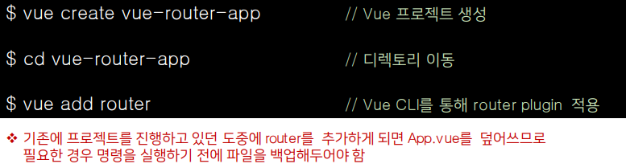

- history mode 사용여부 -> Yes

#### History mode

- 브라우저의 History API를 활용한 방식
  
  - 새로고침 없이 URL 이동 기록을 남길 수 있음

- 우리에게 익숙한 URL 구조로 사용 가능
  
  예시) http://localhost:8080/index

- [참고] History mode를 사용하지 않으면 Default 값인 hash mode로 설정됨 ('#'을 통해 URL을 구분하는 방식)
  
  예시) http://localhost:8080#index

#### Vue Router 시작하기

- App.vue
  
  - router-link 요소 및 router-view가 추가됨

- router/index.js 생성

- views 폴더 생성

#### <mark>**router-link**</mark>

- a 태그와 비슷한 기능 -> URL을 이동시킴
  
  - routes 등록된 컴포넌트와 매핑됨
  
  - 히스토리 모드에서 router-link는 클릭 이벤트를 차단하여 a 태그와 달리 브라우저가 페이지를 다시 로드 하지 않도로 함

- 목표 경로는 <mark>**'to'**</mark> 속성으로 지정됨

- 개발자 도구 확인

#### <mark>**router-view**</mark>

- 주어진 URL에 대해 일치하는 컴포넌트를 렌더링 하는 컴포넌트

- 실제 component가 DOM에 부착되어 보이는 자리를 의미

- router-link를 클릭하면 routes에 매핑된 컴포넌트를 렌더링

- Django에서의 block tag와 비슷함
  
  - App.vue는 base.html의 역할
  
  - router-view는 block 태그로 감싼 부분

- 개발자 도구 확인

#### src/router/index.js

- 라우터에 관련된 정보 및  설정이 작성 되는 곳

- Django에서의 url.py에 해당

- routes에 URL와 컴포넌트를 매핑

- Django의 urlpatterns의 path와 비교
  
  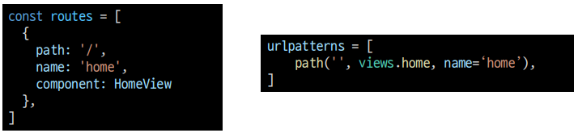

#### src/views

- router-view에 들어갈 component 작성

- 기존에 컴포넌트를 작성하던 곳은 components 폴더 뿐이었지만 이제 두 폴더로 나뉘어짐

- 각 폴더 안의 .vue 파일들이 기능적으로 다른 것은 아님

- 이제 폴더별 컴포넌트 배치는 다음과 같이 진행 (규약은 아님)

- views/
  
  - routes에 매핑되는 컴포넌트, 
    즉, <router-view>의 위치에 렌더링 되는 컴포넌트를 모아두는 폴더
  
  - 다른 컴포넌트와 구분하기 위해 View로 끝나도록 만드는 것을 권장

- components/
  
  - routes에 매핑된 컴포넌트의 하위 컴포넌트를 모아두는 폴더

## Vue Router 실습

#### 주소를 이동하는 2가지 방법

1. 선언적 방식 네비게이션

2. 프로그래밍 방식 네비게이션

#### 선언적 방식 네이게이션

- router-link의 <mark>**'to'**</mark> 속성으로 주소 전달
  
  - routes에 등록된 주소와 매핑된 컴포넌트로 이동
    
    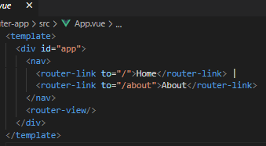

#### Named Routes

- 이름을 가지는 routes
  
  - Django에서 path 함수의 name 인자의 활용과 같은 방식

#### 선언적 방식 네이게이션

- 동적인 값을 사용하기 때문에 v-bind를 사용해야 정상적으로 작동
  
  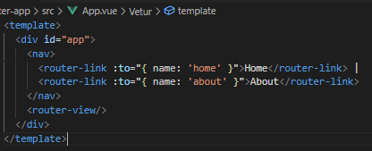

#### 프로그래밍 방식 네이게이션

- Vue 인스턴스 내부에서 라우터 인스턴스에 <mark>**\$router**</mark>로 접근 할 수 있음

- 다른 URL로 이동하려면 <mark>**this.\$router.push**</mark>를 사용
  
  - history stack에 이동할 URL을 넣는(push) 방식
  
  - history stack에 기록이 남기 때문에 사용자가 브라우저의 뒤로 가기 버튼을 클릭하면 이전 URL로 이동할 수 있음

- 결국 <router-link : to="...">를 클릭하는 것과 
  \$router.push(...)를 호출하는 것은 같은 동작
  
  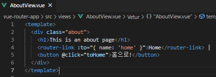

#### Dynamic Route Matching

- 동적 인자 전달
  
  - URL의 특정 값을 변수처럼 사용할 수 있음

- ex) Django에서의 variable routing

- HelloView.vu 작성 및 route 추가

- **route를 추가할 때 동적 인자를 명시**
  
  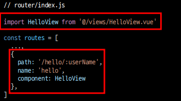

- <mark>**\$route.params**</mark>로 변수에 접근 가능
  
  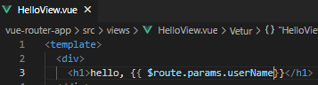

- 다만 HTML에서 직접 사용하기 보다는 data에 넣어서 사용하는 것을 권장
  
  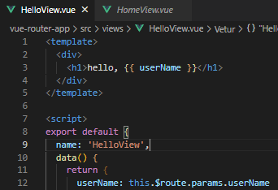

#### Dynamic Route Matching - 선언적 방식 네이게이션

- App.vue에서 harry에게 인사하는 페이지로 이동해보기

- params를 이용하여 동적 인자 전달 가능
  
  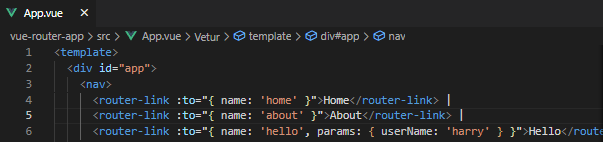

#### Dynamic Route Matching - 프로그래밍 방식 네비게이션

- AboutView에서 데이터를 입력 받아 HelloView로 이동하여 입력받은 데이터에게 인사하기
  
  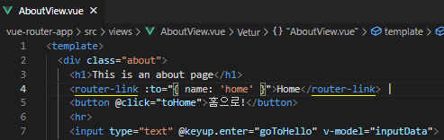
  
  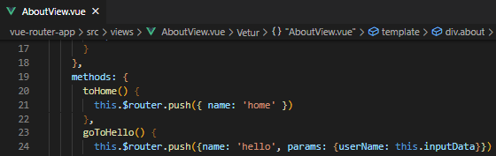

#### route에 컴포넌트를 등록하는 또다른 방법

- router/index.js에 컴포넌트를 등록하는 또다른 방식이 주어지고 있음(about)

- 기존 방식
  
  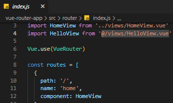

- Lazy-loading
  
  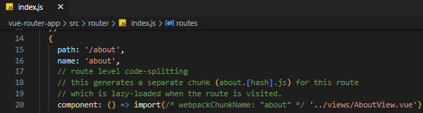

#### lazy-loading

- 모든 파일을 한 번에 로드하려고 하면 모든 걸 다 읽는 시간이 매우 오래 걸림

- 미리 로드(랜더링)를 하지 않고 특정 라우트에 방문할 때 매핑된 컴포넌트의 코드를 로드하는 방식을 활용할 수 있음
  
  - 모든 파일을 한 번에 로드하지 않아도 되기 때문에 최초에 로드하는 시간이 빨라짐
  
  - 당장 사용하지 않을 컴포넌트는 먼저 로드하지 않는 것이 핵심

## Navigation Guard

#### 네비게이션 가드

- Vue router를 통해 특정 URL에 접근할 때 다른 url로 direct를 하거나 해당 URL로의 접근을 막는 방법
  
  ex) 사용자의 인증 정보가 없으면 특정 페이지에 접근하지 못하게 함

- [Navigation Guards | Vue Router](https://v3.router.vuejs.org/guide/advanced/navigation-guards.html)

#### 네비게이션 가드의 종류

- 전역 가드
  
  - 애플리케이션 전역에서 동작

- 라우터 가드
  
  - 특정 URL에서만 동작

- 컴포넌드 가드
  
  - 라우터 컨포넌트 안에 정의

#### 전역가드 (Global Before Guard)

- 다른 url 주소로 이동할 때 항상 실행

- router/index.js에 <mark>**router.beforeEach()**</mark>를 사용하여 설정

- 콜백 함수의 값으로 다음과 같이 3개의 인자르 받음
  
  - to : 이동할 URL 정보가 덤긴 Route 객체
  
  - from : 현재 URL 정보가 담긴 Route 객체
  
  - next : 지정한 URL로 이동하기 위해 호출하는 함숨
    
    - 콜백 함수 내부에서 반드시 한 번만 호출되어야함

- URL이 변경되어 화면이 전환되기 전 router.beforeEach() 가 호출됨
  
  - 화면이 전환되지 않고 대기 상태가 됨

- 변경된 URL로 라우팅하기 위해서는 next()를 호출해줘야 함
  
  - next()가 호출되기 전까지 화면이 전환되지 않음

#### Global Before Guard 실습

- '/home'으로 이동하더라고 라우팅이 되지 않고 아래와 같이 로그만 출력됨

- next() 가 호출되지 않으면 화면이 전환되지 않음
  
  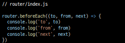

- next()가 호출되어야 화면이 전환됨
  
  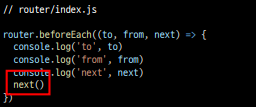

- About으로 이동해보기
  
  - to에는 이동할 url인 about에 대한 정보가
  
  - from에는 현재 url인 home에 대한 정보가 들어있음

#### Login 여부에 따른 라우팅 처리

- Login이 되어있지 않다면 Login 페이지로 이동하는 기능 추가
  
  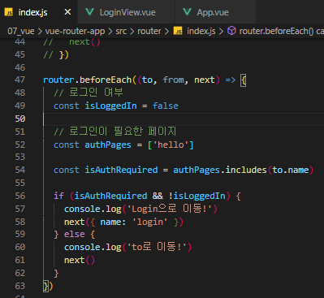

- Home => Login으로 이동했는데 console창에 log가 2개가 찍힌 이유
  
  - 첫번째 출력은 접속 시도 후 (전역 가드에 막힘) 전역 가드에서 login으로 이동 요청할 때 출력
  
  - 두번째 출력은 /login으로 이동 요청 할 때 출력

- 만약 view들이 여러 개라면 모두 추가해주어야 할까?
  
  - 반대로 Login하지 않아도 되는 페이지들을 모아 둘수도 있음
    
    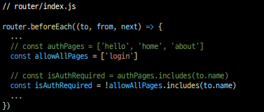

#### 라우터 가드

- 전체 route가 아닌 특정 route에 대해서만 가드를 설정하고 싶을 때 사용

- <mark>**beforeEnter()**</mark>
  
  - route에 진입했을 때 실행됨
  
  - 라우터를 등록한 위치에 추가
  
  - 단 매개변수, 쿼리, 해시 값이 변경될 때는 실행되지 않고 다른 경로에서 탐색할 때 만 실행됨
  
  - 콜백 함수는 to, from, next를 인자로 받음

#### Login 여부에 따른 라우트 처리

- "이미 로그인 되어있는 경우 HomeView로 이동하기"

- 라우터 가드 실습을 위해 전역 가드 실습코드는 주석처리
  
  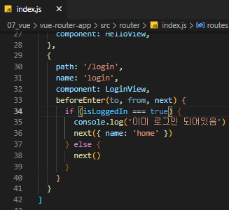

#### 컴포넌트 가드

- 특정 컴포넌트 내에서 가드를 지정하고 싶을 때 사용

- <mark>**beforeRouteUpdate()**</mark>
  
  - 해당 컴포넌트를 렌더링하는 경로가 변경될 때 실행

#### Params 변화 감지

- 변화하지 않는 이유
  
  - 컴포너느가 재사용되었기 때문
  
  - 기존 컴포넌트를 지우고 새로 만드는 것보다 효율적
    
    - 단, lifecycle hook이 호출되지 않음
    
    - 따라서 \$route.params에 있는 데이터를 새로 가져오지 않음

- beforeRouteUpdate()를 사용해서 처리
  
  - userName을 이동할 params에 있는 userName으로 재할당
    
    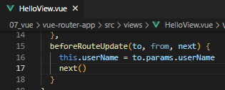

#### 404 Not Found

- 사용자가 요청한 리소스가 존재하지 않을 때 응답
  
  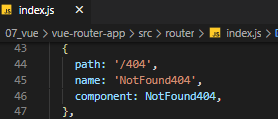

- 모든 경로에 대해서 404 page로 redirect 시키기 
  
  - 기존에 명시한 경로가 아닌 모든 경로가 404 pages로 redirect 됨
  
  - <mark>이때, routes에 **최하단부**에 작성해야함</mark>
    
    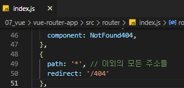 

#### 형식은 유효하지만 특정 리소스를 찾을 수 없는 경우

- Dog API 문서([Dog API](https://dog.ceo/dog-api/)) 를 참고하여 동적 인자로 강아지 품종을 전달해 품종에 대한 랜덤 이미지를 출력하느 페이지를 만들어보기

#### npm 설치

- npm i axios 로 설치

- import axios from 'axios' 로 import

(108)
